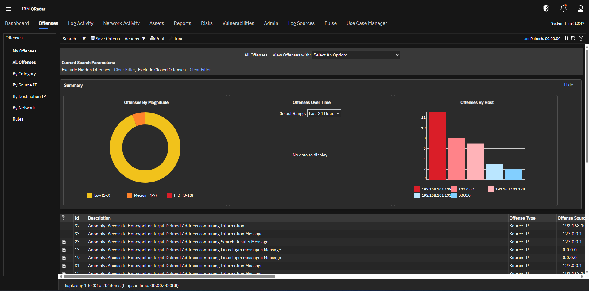

# QRadar Offense Analysis Lab

A SOC-style blue-team portfolio project that documents how IBM QRadar offenses can be investigated, validated, explained, and improved through analyst reasoning, offense pivots, screenshot-backed evidence, IOC extraction, and detection-tuning recommendations.

This repository is intentionally written like a **junior SOC / blue-team analyst portfolio project** rather than a simple screenshot dump. The goal is to show not only **what fired**, but also:

- **why it mattered**
- **what evidence was reviewed**
- **what alternative explanations were considered**
- **how a SOC analyst should think about the offense**
- and **what should happen next**

---

# Project Goal
The goal of this project is to demonstrate how suspicious activity in **IBM QRadar** can be investigated using:

- offense review
- authentication pattern analysis
- screenshot-supported evidence
- MITRE ATT&CK interpretation
- IOC extraction
- AQL pivot logic
- and SOC-style reporting

This project focuses on **analyst reasoning**, not just alert collection.

That means each offense is treated as a mini investigation rather than a generic alert note.

---

# What This Project Demonstrates

This repository is designed to show practical blue-team skills such as:

- **QRadar offense triage**
- **Authentication abuse investigation**
- **Brute force and password spraying analysis**
- **Failed-login-followed-by-success analysis**
- **Privileged account targeting review**
- **Username enumeration detection**
- **Honeypot / tarpit alert interpretation**
- **Host discovery and reconnaissance analysis**
- **AQL-style hunting and pivot thinking**
- **IOC extraction and analyst documentation**
- **Detection engineering awareness**
- **SOC reporting and escalation logic**

---

# Core Security Themes Covered

This repository focuses on recurring offense patterns that are common and important in SOC environments:

## 1) Brute Force / Password Spraying
Repeated failed authentication attempts that may indicate credential guessing behavior.

## 2) Failed Logins Followed by Success
A higher-signal pattern that may suggest successful credential abuse or account compromise.

## 3) Privileged Account Targeting
Suspicious attention directed toward identities such as:

- `root`
- `admin`
- `Administrator`

## 4) Invalid / Bad Username Enumeration
Identity reconnaissance behavior intended to discover valid account names.

## 5) Honeypot / Tarpit Interaction
High-confidence suspicious activity involving monitored or deceptive assets.

## 6) Host Discovery / Reconnaissance
Exploratory activity intended to identify systems, assets, or worthwhile targets.

---

# Evidence Overview

## QRadar Offense Overview


### What this screenshot shows
This screenshot provides the **high-level QRadar offense view** for the investigation set used in this project.

It acts as the starting point for the portfolio because it visually confirms that the environment contains **multiple meaningful offenses** rather than a single isolated event.

### Why this matters
This screenshot is useful because it shows that the project is based on:

- grouped offense analysis,
- offense prioritization,
- and repeated suspicious patterns

instead of just one screenshot or one random log event.

In a real SOC workflow, this is where analysts often begin:

> reviewing the offense queue, prioritizing risk, and deciding what deserves deeper investigation.

---

# Repository Structure

```text
README.md                         -> Project overview and reviewer guide
CASE_INDEX.md                     -> Fast summary of all cases
DETECTION_GAPS.md                 -> Visibility and tuning improvement opportunities
LESSONS_LEARNED.md                -> Key blue-team takeaways

docs/
  executive-summary.md            -> Short reviewer briefing
  attack-story.md                 -> End-to-end attack narrative
  lab-environment.md              -> Lab context and assumptions
  mitre-mapping.md                -> ATT&CK-aligned interpretation
  offense-analysis-methodology.md -> Repeatable analyst workflow
  triage-workflow.md              -> Quick triage model
  triage-runbook.md               -> SOC-style offense review workflow
  interview-talk-track.md         -> Talking points for recruiters/interviewers

offenses/
  001-008 case files              -> Detailed offense investigations
  offense-template.md             -> Reusable analyst case structure

queries/
  useful-aql-queries.md           -> Investigation-focused query ideas
  aql-hunting-library.md          -> Reusable hunting queries
  triage-pivot-checklist.md       -> Pivot logic during offense review

rules/
  observed-qradar-rules.md        -> Likely rule behavior observed
  correlation-observations.md     -> Rule and offense logic notes
  rule-tuning-recommendations.md  -> Suggested detection improvements

use-cases/
  Detection concept writeups      -> Reusable blue-team use cases

iocs/
  extracted-iocs.md               -> Consolidated indicators
  suspicious-source-ips.md        -> Source IP review
  targeted-usernames.md           -> Identity targeting review
  attacked-assets.md              -> Targeted systems review

reports/
  incident-summary.md             -> Consolidated SOC-style summary

screenshots/
  QRadar evidence used across the case files

tools/
  ioc_extractor.py                -> Example helper script for extracting IOCs
