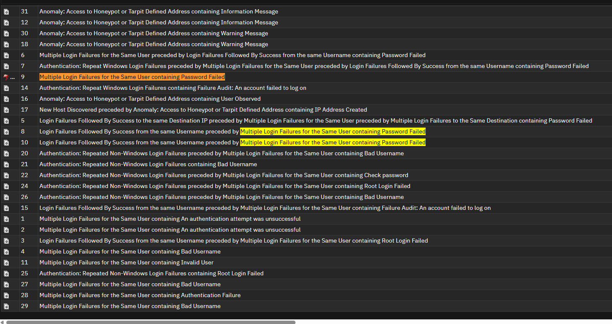
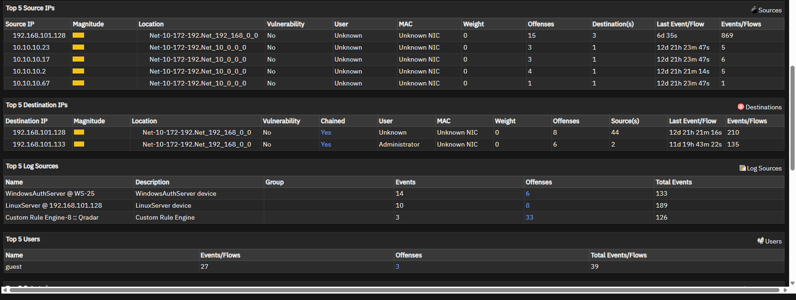
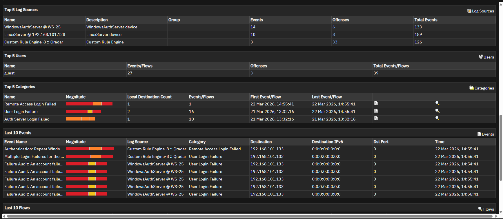

# Offense 001 — Brute Force and Password Spraying

## 1. Executive Summary
This offense reviews repeated authentication failures to determine whether the activity is more consistent with normal user error or deliberate credential abuse.

The observed pattern is significant because it appears **systematic rather than accidental**. Instead of a single user repeatedly failing one login, the offense suggests a broader authentication pressure pattern that may indicate either:

- **brute-force attempts** against a smaller number of accounts, or
- **password spraying** across a wider user set.

This type of activity is important in a SOC because it often represents the **early stage of account compromise attempts**.

---

## 2. Detection Trigger
- **Observed Theme:** Repeated authentication failures
- **Likely QRadar Logic:** Authentication failures grouped into a single offense based on repetition and event concentration
- **Primary Risk:** Credential guessing / unauthorized account access attempts
- **Suggested Severity:** Medium to High
- **Analyst Confidence:** High

---

## 3. Why This Offense Matters
Authentication failures happen frequently in real environments and are often noisy.

However, they become much more important when they show patterns such as:

- repeated attempts from the same source,
- multiple targeted usernames,
- broad user coverage,
- or repeated access attempts across the same systems.

That transition — from **random failure** to **behavioral pattern** — is what makes this offense relevant.

This is exactly the kind of case where a SOC analyst must decide:

> “Is this just noise, or is this an attacker trying to get in?”

---

## 4. Initial Analyst Hypothesis
The activity is more likely to represent **credential abuse behavior** than normal login mistakes.

At the start of the investigation, the main hypothesis is:

> A source or group of sources is attempting repeated logins against one or more accounts in a way that resembles brute force or password spraying.

The investigation goal is to determine:
- whether the activity is concentrated or broad,
- whether usernames are valid or guessed,
- and whether the pattern escalates into successful access.

---

## 5. Evidence Reviewed

### Screenshot 1 — Offense Overview

**What this screenshot helps show:**  
This provides the initial QRadar offense context and confirms that the event grouping is centered around suspicious authentication activity.

**Why it matters:**  
This is the starting point for determining whether the offense is simply noisy or worthy of escalation.

---

### Screenshot 2 — Username Targeting Pattern

**What this screenshot helps show:**  
This view is useful for identifying whether multiple usernames are being targeted.

**Why it matters:**  
If many usernames are involved, the behavior becomes more consistent with **password spraying** rather than a single user mistyping a password.

---

### Screenshot 3 — Source IP Pattern

**What this screenshot helps show:**  
This screenshot helps validate whether repeated failures are coming from a concentrated source or source group.

**Why it matters:**  
Source concentration is one of the strongest indicators that the activity may be attacker-driven rather than accidental.

---

## 6. Key Evidence Points
The most meaningful indicators in this offense are:

- repeated authentication failures,
- visible concentration of source behavior,
- signs of username targeting,
- and an overall pattern that appears systematic rather than random.

### Why that matters
A single failed login is usually not meaningful.

A repeated and structured failure pattern is different because it may indicate:
- password guessing,
- account discovery,
- or a deliberate attempt to gain access without valid credentials.

---

## 7. Investigation Steps
The recommended analyst workflow for this offense is:

1. Review the offense summary and grouped events.
2. Identify the most repeated source IP or host involved.
3. Pivot into usernames associated with the repeated failures.
4. Determine whether the same source targeted one account or many.
5. Check whether any of the targeted accounts later authenticated successfully.
6. Compare the source behavior against expected internal systems, scanners, or admin tooling.
7. Assess whether the behavior is isolated noise or part of a broader attack chain.

---

## 8. Analyst Interpretation
The offense pattern is more consistent with **credential abuse behavior** than with ordinary user error.

### Why
The evidence suggests:

- repeated activity,
- structure rather than randomness,
- and possible identity spread.

That combination strongly aligns with:

- **brute force** if the source is repeatedly targeting a smaller set of users, or
- **password spraying** if the source is touching a broader set of usernames with fewer attempts per account.

### Security meaning
This offense likely represents an attacker or automated process attempting to validate or guess credentials.

That makes it an important early-stage offense, even if there is no confirmed successful access yet.

---

## 9. False Positive Considerations
Before escalating this offense as malicious, a good analyst should consider benign explanations such as:

- a user repeatedly typing the wrong password,
- a stale password stored in a service or script,
- an internal authentication testing tool,
- or noisy login retries from administrative systems.

### Why those are less convincing here
Those explanations usually produce:
- one username,
- one service account,
- or a more predictable internal pattern.

When the offense shows:
- repeated source concentration,
- multiple usernames,
- or broader account coverage,

the behavior becomes less likely to be accidental.

---

## 10. MITRE ATT&CK Mapping
- **Tactic:** Credential Access
- **Technique:** **T1110 — Brute Force**

### Why this fits
This technique is appropriate because the offense reflects repeated attempts to gain access using guessed or tested credentials rather than already-validated account access.

Depending on the exact pattern, this may also overlap with:
- password spraying behavior,
- account discovery,
- or broader identity-focused reconnaissance.

---

## 11. Recommended Validation / Next Steps
To strengthen or disprove the suspicion, the SOC should:

- pivot on the top source IP,
- identify all usernames associated with that source,
- check whether any targeted account later logged in successfully,
- validate whether the accounts are valid internal users,
- determine whether privileged accounts were included,
- and compare the activity to expected internal authentication behavior.

### Escalate faster if:
- the source is external,
- a privileged account is involved,
- or a successful login follows the failures.

---

## 12. Final Analyst Verdict
**Assessment:** Suspicious activity consistent with credential guessing / authentication abuse.

**SOC Action:**  
Continue investigation, validate the source and targeted identities, and escalate if successful access or privileged targeting is confirmed.
