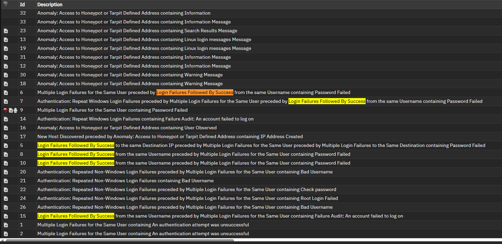
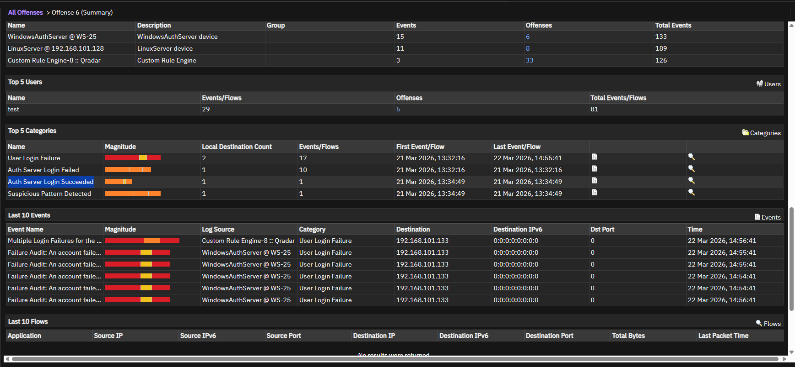

# Offense 002 — Failed Logins Followed by Success

## 1. Executive Summary
This offense is one of the most important cases in the repository because it reflects a high-value authentication pattern:

> repeated failed login attempts followed by a successful authentication.

This pattern is operationally important because it may indicate:

- a user eventually remembering the correct password,
- a benign retry after an error,
- **or**
- an attacker successfully gaining access after repeated credential guessing.

In a SOC environment, this type of sequence should receive **higher priority than failure-only authentication noise** because it suggests that an access attempt may have actually succeeded.

---

## 2. Detection Trigger
- **Observed Theme:** Failed authentication attempts followed by a successful login
- **Likely QRadar Logic:** Repeated authentication failures correlated with a later successful authentication event
- **Primary Risk:** Possible credential compromise / successful unauthorized access
- **Suggested Severity:** High
- **Analyst Confidence:** High

---

## 3. Why This Offense Matters
Authentication failures by themselves are often noisy.

However, once those failures are followed by a successful login, the security meaning changes significantly.

### Why this matters in practice
This sequence may indicate that:

- a valid password was eventually guessed,
- a previously unknown credential was discovered,
- or a targeted account was successfully accessed after trial-and-error attempts.

That makes this pattern far more actionable than generic failed-login alerts.

### Analyst mindset
A good SOC analyst should treat this as a **possible compromise indicator until proven otherwise**.

---

## 4. Initial Analyst Hypothesis
The initial hypothesis for this case is:

> repeated failed authentication attempts may have eventually resulted in successful access.

The main investigation goal is to determine whether the successful authentication is:

- clearly benign,
- suspicious but inconclusive,
- or strongly indicative of account compromise.

To answer that, the analyst needs to examine:

- source consistency,
- username consistency,
- target host context,
- and what happened immediately after the successful login.

---

## 5. Evidence Reviewed

### Screenshot 1 — Offense Overview

**What this screenshot helps show:**  
This provides the offense-level QRadar context and establishes that the grouped activity is centered around authentication events.

**Why it matters:**  
It confirms that this is not just a single isolated login event, but part of a broader sequence that needs interpretation.

---

### Screenshot 2 — Supporting Pattern View

**What this screenshot helps show:**  
This is the most important screenshot in this case because it helps illustrate the transition from repeated failed authentication to successful access.

**Why it matters:**  
That transition is often the difference between:
- low-priority login noise,
- and a real incident requiring escalation.

---

## 6. Key Evidence Points
The strongest indicators in this case are:

- multiple failed authentication attempts,
- a later successful login event,
- and the implied progression from access attempts to access achieved.

### Why this is high signal
This type of pattern often means the investigation should move from:

> “Is someone trying to log in?”

to:

> “Did someone actually get in?”

That is a major shift in triage importance.

---

## 7. Investigation Steps
A proper analyst review for this offense should follow this process:

1. Review the offense summary and grouped authentication events.
2. Identify the username(s) involved in the failed attempts.
3. Confirm whether the successful login is associated with:
   - the same username,
   - the same source IP,
   - or the same target system.
4. Determine whether the source is:
   - internal,
   - external,
   - expected,
   - or unusual.
5. Review whether the account is:
   - privileged,
   - service-based,
   - or tied to sensitive systems.
6. Check for suspicious activity after the successful authentication.
7. Assess whether the sequence is more consistent with benign user behavior or successful credential abuse.

---

## 8. Analyst Interpretation
This offense is **meaningfully more dangerous than repeated authentication failures alone**.

### Why
The most important signal is not the failure count — it is the **progression**.

Progression suggests intent and potential success.

That makes this offense more consistent with:

- successful credential guessing,
- valid account abuse,
- or attacker persistence after repeated login attempts.

### Security meaning
Even if the final explanation turns out to be benign, this pattern is important because it closely resembles how real account compromise often begins.

This is exactly the type of offense a SOC should review quickly and carefully.

---

## 9. False Positive Considerations
There are still benign explanations that must be considered.

### Possible false positives
- A legitimate user may have typed the wrong password several times before logging in successfully.
- A password reset or account unlock may have created a failure-then-success chain.
- A cached or stale credential may have failed before the user re-authenticated properly.
- A login portal or SSO flow may have created multiple related events.

### Why those explanations are not always enough
Those explanations become less convincing when:

- the source IP is unusual,
- the account is privileged,
- the login time is suspicious,
- the source is external,
- or the successful login is followed by additional unusual activity.

That is why context matters so much in this offense.

---

## 10. MITRE ATT&CK Mapping
- **Primary Tactic:** Credential Access
- **Primary Technique:** **T1110 — Brute Force**
- **Secondary Technique:** **T1078 — Valid Accounts**

### Why this fits
This case may begin as brute-force or credential-guessing behavior, but if the successful login is attacker-driven, it transitions into the use of a valid account.

That makes this offense especially valuable because it may show the shift from:

- **attempted access**
to
- **successful access**

---

## 11. Recommended Validation / Next Steps
The SOC should validate this offense using the following pivots:

- confirm whether the same source IP is associated with both the failures and the success,
- validate whether the same username appears across the event chain,
- review whether the account is privileged or sensitive,
- examine whether the source is known, trusted, or external,
- and review post-authentication activity for suspicious follow-on behavior.

### Escalate immediately if:
- the account is privileged,
- the source is external or unexpected,
- the host is sensitive,
- or the successful login is followed by abnormal activity.

---

## 12. Final Analyst Verdict
**Assessment:** High-risk authentication sequence that may indicate successful credential abuse or account compromise.

**SOC Action:**  
Prioritize investigation, validate source and account legitimacy, and escalate or contain the account if the login context remains suspicious.
