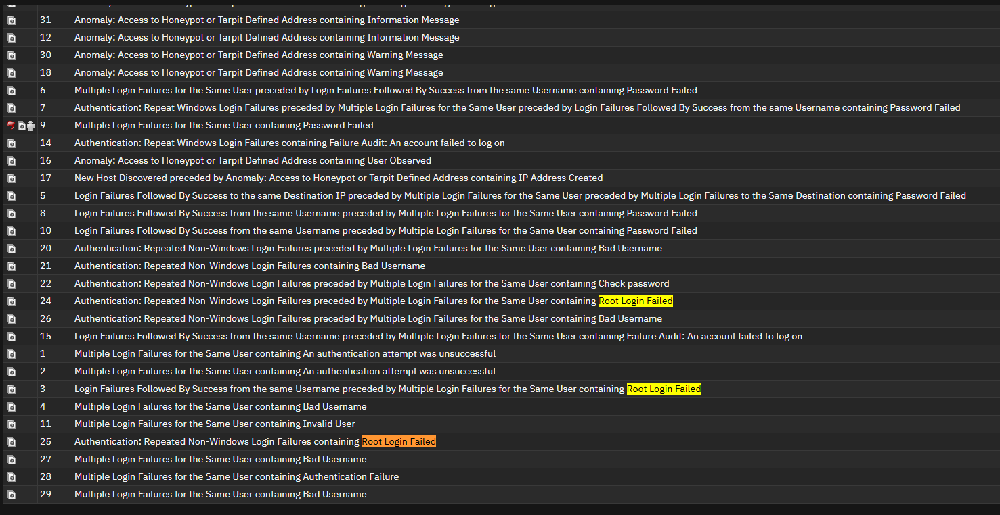
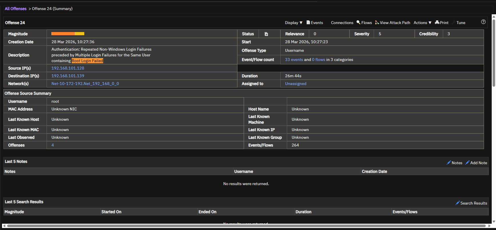
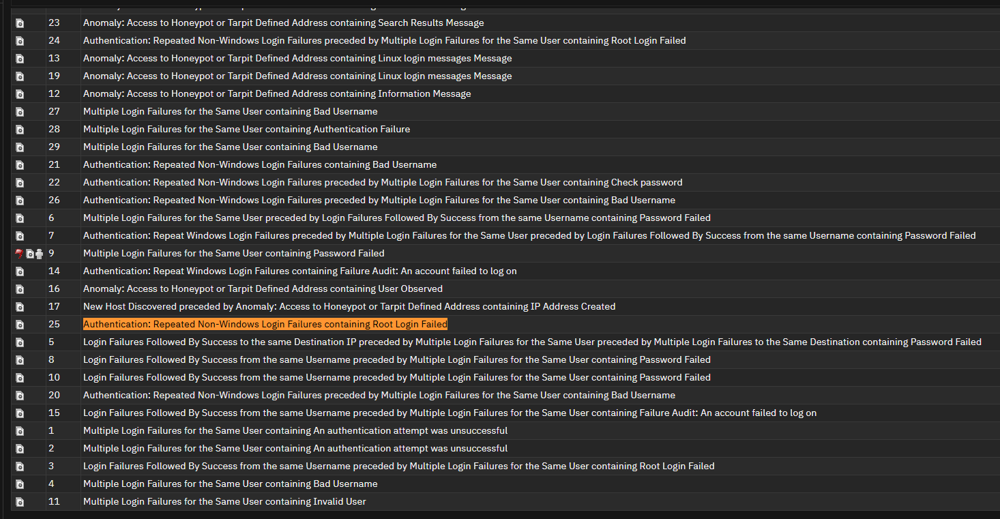

# Offense 003 — Root Account Targeting

## 1. Executive Summary
This offense focuses on attempts directed toward **privileged accounts**, specifically identities such as:

- `root`
- `admin`
- `Administrator`

This pattern is important because privileged accounts carry a much higher security impact than standard user accounts. Even if the event count is not extremely high, the **risk is elevated immediately** when attacker attention shifts toward administrative identities.

From an analyst perspective, this offense matters because it may indicate:

- privilege-focused credential guessing,
- access attempts against default or administrative accounts,
- or targeted efforts to gain elevated control over systems.

In a real SOC environment, privileged account targeting should always trigger a more serious triage posture than ordinary authentication noise.

---

## 2. Detection Trigger
- **Observed Theme:** Authentication attempts involving privileged or administrative accounts
- **Likely QRadar Logic:** Repeated failed authentication or suspicious account access attempts involving high-value identities
- **Primary Risk:** Unauthorized privileged access / potential high-impact compromise
- **Suggested Severity:** High
- **Analyst Confidence:** High

---

## 3. Why This Offense Matters
Not all login attempts are equally dangerous.

A failed login against a normal user account may be low or medium concern depending on context.

A failed login against `root` or another privileged identity is different because a successful access attempt could immediately enable:

- administrative control,
- broader system access,
- lateral movement,
- persistence,
- or credential theft.

### Why this changes the triage mindset
This offense should not be evaluated only by:

- event count,
- repetition,
- or alert volume.

It should also be evaluated by **impact potential**.

That is why privileged account targeting is such a strong signal even when the raw number of events is relatively small.

---

## 4. Initial Analyst Hypothesis
The initial working hypothesis is:

> An actor or automated process is attempting to gain access to a high-value administrative account.

This may represent:

- brute-force behavior against privileged accounts,
- opportunistic attempts against common default usernames,
- or a more deliberate privilege-oriented access attempt.

The main investigation goal is to determine whether the targeting is:

- random and noisy,
- expected internal behavior,
- or a meaningful attempt to obtain elevated access.

---

## 5. Evidence Reviewed

### Screenshot 1 — Offense Overview

**What this screenshot helps show:**  
This screenshot establishes the QRadar offense context and confirms that the grouped activity is centered around suspicious authentication behavior involving privileged account access attempts.

**Why it matters:**  
This is the entry point for validating whether the offense is operational noise or a meaningful privileged-access threat.

---

### Screenshot 2 — Privileged Account Targeting Pattern

**What this screenshot helps show:**  
This screenshot is the most important evidence in this case because it highlights attention directed toward privileged usernames.

**Why it matters:**  
When attacker activity includes accounts like `root`, `admin`, or `Administrator`, the risk level increases significantly because those identities typically grant elevated access.

---

### Optional Supporting Screenshot

**What this screenshot helps show:**  
This image can be used as supporting evidence for repeated or concentrated targeting of administrative identities.

**Why it matters:**  
Multiple supporting screenshots strengthen the interpretation that this was not just generic login noise but activity with a privileged focus.

---

## 6. Key Evidence Points
The most important indicators in this offense are:

- authentication activity directed toward privileged accounts,
- visible focus on administrative identity naming patterns,
- and offense grouping that suggests these attempts were notable enough to be correlated.

### Why that matters
Administrative identities are disproportionately valuable to attackers.

Even a small number of suspicious attempts against these accounts should be treated more seriously than a larger number of failures against ordinary user accounts.

---

## 7. Investigation Steps
A proper analyst review for this offense should include:

1. Review the offense summary and grouped event context.
2. Confirm which privileged usernames were targeted.
3. Identify whether the attempts were:
   - from one source,
   - from multiple sources,
   - internal,
   - or external.
4. Determine whether the account names are:
   - valid internal accounts,
   - common default usernames,
   - or guessed administrative identities.
5. Check whether any of the targeted accounts later authenticated successfully.
6. Review whether the targeted systems are:
   - exposed,
   - sensitive,
   - or high-value assets.
7. Determine whether this offense overlaps with broader brute-force or reconnaissance activity.

---

## 8. Analyst Interpretation
This offense is high-value because it reflects **privilege-oriented attacker interest** rather than generic login noise.

### Why
The difference here is not just repetition — it is **intent**.

Targeting `root` or similar identities suggests that the actor is not merely trying random access, but attempting to gain access to accounts that could immediately provide control or elevated privileges.

### Security meaning
This behavior is consistent with:

- brute-force attempts against privileged accounts,
- opportunistic admin account targeting,
- or early-stage access attempts intended to achieve elevated system access.

This makes the offense worthy of a more urgent and serious response than standard authentication failure patterns.

---

## 9. False Positive Considerations
There are still benign explanations that should be considered.

### Possible false positives
- An administrator may have mistyped a privileged password.
- Internal testing may have included administrative account checks.
- A monitoring or scanning tool may have attempted default usernames.
- A stale credential stored in a script or service may be generating repeated admin-related failures.

### Why those explanations are not always enough
Those possibilities become less convincing when:

- the source is unusual or external,
- the activity targets multiple privileged usernames,
- the behavior overlaps with broader credential abuse patterns,
- or the same source appears in other suspicious offenses.

That is why source validation and cross-offense comparison are so important here.

---

## 10. MITRE ATT&CK Mapping
- **Primary Tactic:** Credential Access
- **Primary Technique:** **T1110 — Brute Force**
- **Secondary Tactic:** Privilege Escalation
- **Secondary Technique Consideration:** **T1078 — Valid Accounts** (if successful access is later observed)

### Why this fits
This offense aligns with brute-force-style behavior because it reflects attempts to gain access by guessing or testing credentials.

It becomes even more significant if a targeted privileged account is later used successfully, at which point the behavior may overlap with valid-account abuse.

---

## 11. Recommended Validation / Next Steps
The SOC should validate this offense by:

- confirming whether the targeted privileged accounts are real and active,
- identifying whether the source is internal, external, expected, or suspicious,
- checking whether any of the targeted accounts later authenticated successfully,
- determining whether the activity overlaps with other brute-force or username-enumeration patterns,
- and reviewing whether the destination hosts are sensitive or externally exposed.

### Escalate immediately if:
- the source is external,
- the account is active and privileged,
- successful authentication is later observed,
- or the same source appears in multiple suspicious offenses.

---

## 12. Final Analyst Verdict
**Assessment:** Suspicious and high-priority due to privileged account focus and elevated compromise potential.

**SOC Action:**  
Prioritize review, validate the source and account legitimacy, and escalate quickly if the targeted account is active or later used successfully.
