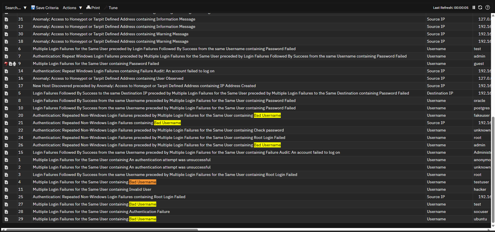
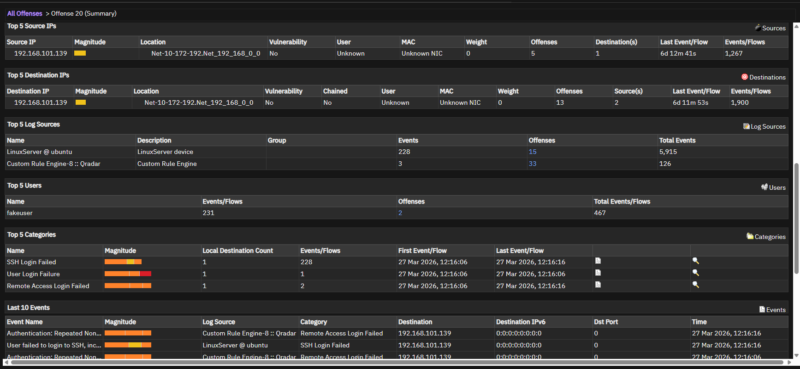
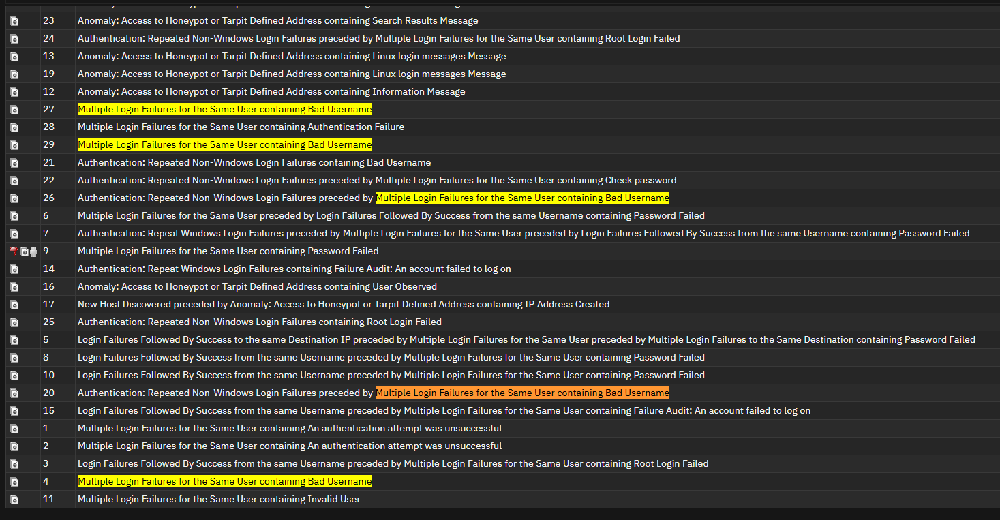

# Offense 004 — Invalid and Bad Username Enumeration

## 1. Executive Summary
This offense focuses on authentication attempts involving **invalid**, **bad**, or clearly incorrect usernames.

At first glance, this type of activity can look low priority because it does not immediately show successful access. However, from a defensive perspective, it is often a meaningful **reconnaissance pattern**.

Why?

Because attackers frequently try to learn:

- which usernames are valid,
- which naming conventions are used internally,
- and which identities are worth targeting later.

That means this offense may represent an **early-stage identity discovery phase** that could precede:

- brute-force attacks,
- password spraying,
- privileged account targeting,
- or later successful account compromise attempts.

In a SOC context, this offense is important because it may reveal attacker preparation before more direct access attempts begin.

---

## 2. Detection Trigger
- **Observed Theme:** Invalid / bad username authentication attempts
- **Likely QRadar Logic:** Authentication failures grouped around usernames that do not appear valid or expected
- **Primary Risk:** Identity reconnaissance / account discovery
- **Suggested Severity:** Medium to High
- **Analyst Confidence:** Medium to High

---

## 3. Why This Offense Matters
Not all authentication abuse begins with correct credentials or even valid usernames.

A common attacker pattern is to first determine:

- which usernames exist,
- which account formats are valid,
- and whether privileged or predictable identities are available.

### Why this matters operationally
This means invalid username events are not always harmless “failed logins.”

They can instead represent:

- account discovery,
- environment familiarization,
- or automated username enumeration.

### Analyst mindset
A good SOC analyst should ask:

> “Is this random bad input, or is someone learning the identity structure of the environment?”

That is the key question in this case.

---

## 4. Initial Analyst Hypothesis
The initial working hypothesis is:

> A source or automated process is attempting to discover valid usernames by testing invalid, guessed, or malformed account names.

The investigation goal is to determine whether the behavior is:

- broad and systematic,
- isolated and accidental,
- or linked to other credential abuse patterns.

The offense becomes more meaningful if it overlaps with:

- brute-force activity,
- privileged account targeting,
- or later successful logins.

---

## 5. Evidence Reviewed

### Screenshot 1 — Offense Overview

**What this screenshot helps show:**  
This provides the QRadar offense-level view and confirms that the grouped events relate to suspicious username-based authentication failures.

**Why it matters:**  
It establishes that this is not just one mistyped login but a grouped pattern worth reviewing as a potential reconnaissance event.

---

### Screenshot 2 — Bad Username Pattern

**What this screenshot helps show:**  
This screenshot is useful for identifying the presence of invalid, malformed, or suspiciously guessed usernames.

**Why it matters:**  
Patterns involving many bad usernames are often more consistent with **enumeration** than with legitimate user mistakes.

---

### Optional Supporting Screenshot

**What this screenshot helps show:**  
This supporting screenshot helps reinforce the idea that the activity may be probing identity structure rather than simply failing to log in.

**Why it matters:**  
Enumeration behavior is often an early precursor to more targeted credential attacks.

---

## 6. Key Evidence Points
The most important indicators in this offense are:

- repeated authentication attempts using invalid or bad usernames,
- visible signs of guessed or non-standard identity input,
- and a pattern that suggests repeated trial behavior rather than normal user login mistakes.

### Why that matters
A normal user usually knows their own username.

When an offense shows many invalid username attempts, it can indicate that the actor is:

- testing naming conventions,
- probing for valid identities,
- or trying to identify high-value accounts for later abuse.

---

## 7. Investigation Steps
A proper analyst review for this offense should include:

1. Review the offense summary and grouped username-related failures.
2. Identify whether the invalid usernames follow a recognizable naming pattern.
3. Determine whether the same source IP is associated with multiple bad usernames.
4. Check whether the source also appears in:
   - brute-force offenses,
   - privileged account targeting,
   - or other suspicious authentication activity.
5. Compare the invalid usernames to known internal naming conventions.
6. Determine whether any of the attempted usernames are close to real accounts.
7. Assess whether the pattern appears random, scripted, or reconnaissance-driven.

---

## 8. Analyst Interpretation
This offense is more consistent with **identity reconnaissance** than with ordinary user login mistakes.

### Why
The strongest signal is not simply that authentication failed — it is **how** it failed.

Repeated attempts using invalid usernames suggest that the actor may not yet know:

- who exists in the environment,
- how usernames are formatted,
- or which accounts are valid.

That is often a sign of attacker learning behavior.

### Security meaning
This offense may represent an **early-stage precursor** to more dangerous activity.

That makes it important not because it confirms compromise, but because it may show the environment being **mapped and prepared for later attack**.

---

## 9. False Positive Considerations
There are still benign explanations that should be reviewed.

### Possible false positives
- A user may have typed the wrong username.
- An internal script or application may be using malformed credentials.
- A test system or QA process may be generating invalid login attempts.
- Parsing or logging issues may make normal usernames appear malformed.

### Why those explanations are not always enough
Those explanations become less convincing when:

- many different bad usernames are involved,
- the source is unusual or external,
- the attempts are repeated and patterned,
- or the same source later appears in more direct credential abuse offenses.

That is why cross-offense correlation matters so much here.

---

## 10. MITRE ATT&CK Mapping
- **Primary Tactic:** Reconnaissance / Credential Access
- **Primary Technique Consideration:** **T1589 — Gather Victim Identity Information**
- **Secondary Technique Consideration:** **T1110 — Brute Force** (if enumeration transitions into credential attacks)

### Why this fits
This offense aligns well with identity-focused reconnaissance because the activity suggests an attempt to learn valid usernames or account structures before access attempts become more precise.

If the same source later transitions into valid username targeting or brute-force behavior, the confidence in that interpretation increases significantly.

---

## 11. Recommended Validation / Next Steps
The SOC should validate this offense by:

- reviewing the attempted usernames for recognizable naming patterns,
- checking whether the source appears in other authentication-related offenses,
- comparing the attempted usernames against real internal account formats,
- validating whether the source is internal, external, or expected,
- and reviewing whether the same actor later targeted valid or privileged accounts.

### Escalate faster if:
- the source is external,
- the behavior is broad and systematic,
- the same source later appears in brute-force activity,
- or the attempted usernames closely resemble real internal accounts.

---

## 12. Final Analyst Verdict
**Assessment:** Suspicious identity reconnaissance / username enumeration behavior that may represent early-stage attacker discovery.

**SOC Action:**  
Monitor and investigate the source, correlate with other authentication abuse offenses, and increase urgency if the behavior transitions into valid-account targeting or successful access.
