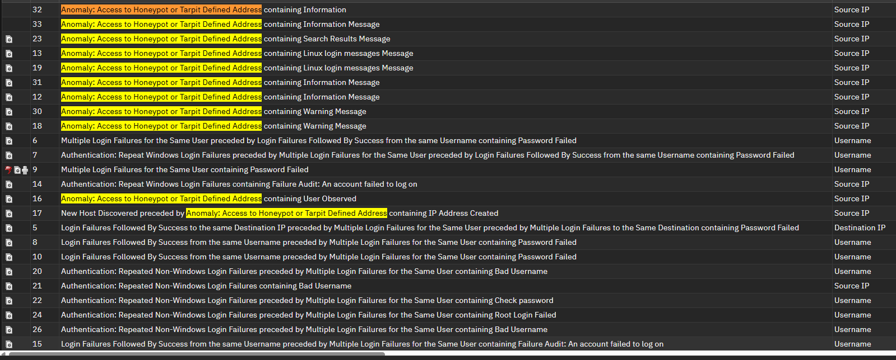
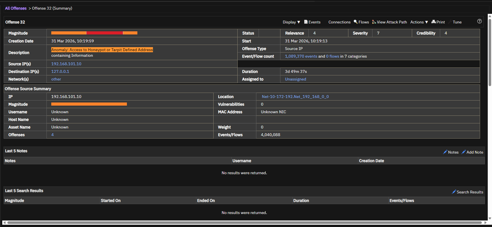
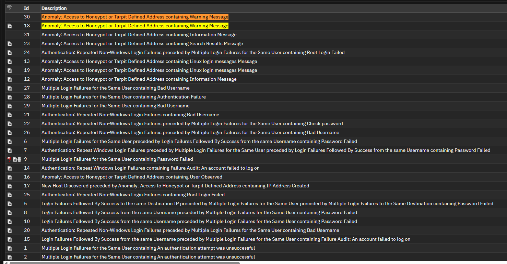

# Offense 005 — Honeypot and Tarpit Access

## 1. Executive Summary
This offense focuses on activity involving **honeypot**, **tarpit**, or otherwise intentionally suspicious / trap-like assets.

Among all the cases in this repository, this is one of the **highest-confidence suspicious patterns** because access to these systems is usually not part of normal business operations.

That means this offense may indicate:

- host discovery,
- scanning,
- opportunistic probing,
- or direct interaction with systems that should not attract legitimate user traffic.

From a blue-team perspective, this type of alert is valuable because it is often **much higher signal and lower noise** than standard authentication failures.

In practical SOC terms:

> If someone is touching a system that nobody should normally touch, that activity deserves serious attention.

---

## 2. Detection Trigger
- **Observed Theme:** Access or interaction involving honeypot / tarpit-style assets
- **Likely QRadar Logic:** Events grouped around systems designated or behaving like trap / monitoring assets
- **Primary Risk:** Reconnaissance / unauthorized access interest / host discovery
- **Suggested Severity:** High
- **Analyst Confidence:** High

---

## 3. Why This Offense Matters
Honeypot and tarpit events are valuable because they are often **cleaner indicators of suspicious behavior** than ordinary enterprise authentication logs.

### Why this matters
Unlike normal production systems, these assets are generally not expected to receive:

- routine user logins,
- ordinary business access,
- or legitimate day-to-day traffic.

That means even relatively small amounts of interaction can be meaningful.

### Analyst mindset
A good analyst should immediately ask:

> “Why would this system be touched at all?”

That question is the foundation of this case.

---

## 4. Initial Analyst Hypothesis
The initial working hypothesis is:

> A source or actor has interacted with a system that should have little or no legitimate business use, suggesting reconnaissance, scanning, or opportunistic probing.

The goal of the investigation is to determine whether the activity is:

- malicious or highly suspicious,
- part of expected lab/testing behavior,
- or an internal artifact that can be explained operationally.

Because of the nature of the target asset, the burden of proof is often reversed here:

- with ordinary auth logs, analysts ask “is this suspicious?”
- with honeypot activity, analysts often ask “is there any good reason this happened?”

That is a major difference.

---

## 5. Evidence Reviewed

### Screenshot 1 — Offense Overview

**What this screenshot helps show:**  
This provides the offense-level QRadar view and establishes that the grouped events are tied to suspicious interaction with a monitored or trap-style asset.

**Why it matters:**  
It confirms that the offense is not generic noise but activity associated with a higher-confidence monitoring scenario.

---

### Screenshot 2 — Honeypot / Tarpit Alert Pattern

**What this screenshot helps show:**  
This is the strongest screenshot in this case because it directly supports the interpretation that a monitored or deceptive host received suspicious attention.

**Why it matters:**  
This kind of evidence usually carries more confidence than normal failed-authentication patterns because legitimate access should be limited or non-existent.

---

### Optional Supporting Screenshot

**What this screenshot helps show:**  
This supporting screenshot can help reinforce the event grouping and provide additional visibility into how the suspicious access was surfaced.

**Why it matters:**  
Multiple consistent views make the offense more defensible as a meaningful signal.

---

## 6. Key Evidence Points
The strongest indicators in this offense are:

- interaction with a honeypot / tarpit-style asset,
- event grouping that treats the interaction as notable,
- and the implication that the source intentionally or opportunistically touched a system that should not normally be in business use.

### Why that matters
This kind of behavior often indicates:

- scanning,
- host discovery,
- service probing,
- or opportunistic access attempts.

It is often more meaningful than generic login failures because the **target itself** is suspiciously interesting.

---

## 7. Investigation Steps
A proper analyst review for this offense should include:

1. Review the offense summary and grouped events.
2. Confirm which asset was designated or behaving as a honeypot / tarpit.
3. Identify the source IP(s) or hosts involved.
4. Determine whether the source is:
   - internal,
   - external,
   - known,
   - or suspicious.
5. Review whether the source touched:
   - only the honeypot,
   - or multiple systems.
6. Determine whether the activity appears to be:
   - scanning,
   - authentication-related,
   - service probing,
   - or exploratory access.
7. Check whether the same source appears in other offenses such as:
   - brute-force attempts,
   - host discovery,
   - or username enumeration.

---

## 8. Analyst Interpretation
This offense is one of the **highest-confidence suspicious cases** in the repository.

### Why
The strongest signal is not only the behavior — it is the **choice of target**.

When an actor touches a honeypot or tarpit-style system, that often suggests they are:

- exploring the environment,
- probing exposed services,
- or interacting with systems they should not know or care about.

### Security meaning
This offense is highly consistent with:

- reconnaissance,
- host discovery,
- opportunistic scanning,
- or low-noise attacker exploration.

Even if the event volume is not high, the confidence in suspicious intent is still elevated because the access target itself is abnormal.

---

## 9. False Positive Considerations
There are still some benign explanations that should be considered.

### Possible false positives
- Internal lab testing or validation activity
- Security team simulation or red-team exercises
- Internal vulnerability scanning
- Asset mislabeling (system appears trap-like but is actually in use)

### Why those explanations are not always enough
Those explanations become less convincing when:

- the source is external,
- the actor touches multiple monitored assets,
- the source overlaps with other suspicious offenses,
- or the traffic pattern resembles scanning or probing rather than admin validation.

Because honeypot-related offenses are already higher-confidence, false-positive validation should be done carefully — but it should not be used to dismiss the signal too quickly.

---

## 10. MITRE ATT&CK Mapping
- **Primary Tactic:** Reconnaissance
- **Primary Technique:** **T1046 — Network Service Scanning**
- **Secondary Technique Consideration:** **T1018 — Remote System Discovery**

### Why this fits
This offense aligns well with reconnaissance behavior because it suggests the actor is identifying or interacting with systems in a way that resembles scanning, probing, or environment exploration.

If the source later attempts authentication or broader access, this offense becomes even more important as part of a larger attack chain.

---

## 11. Recommended Validation / Next Steps
The SOC should validate this offense by:

- confirming the exact role of the honeypot / tarpit asset,
- identifying whether the source is internal, external, or expected,
- reviewing whether the same source touched multiple systems,
- checking whether the source appears in brute-force or discovery-related offenses,
- and validating whether the activity resembles scanning, auth attempts, or service interaction.

### Escalate immediately if:
- the source is external,
- the same source appears across multiple suspicious offenses,
- the source touched multiple monitored assets,
- or the activity appears deliberate rather than accidental.

---

## 12. Final Analyst Verdict
**Assessment:** High-confidence suspicious activity consistent with reconnaissance, probing, or unauthorized interest in monitored assets.

**SOC Action:**  
Prioritize investigation, validate source legitimacy, correlate with other suspicious offenses, and escalate if the activity overlaps with broader scanning or credential abuse behavior.
