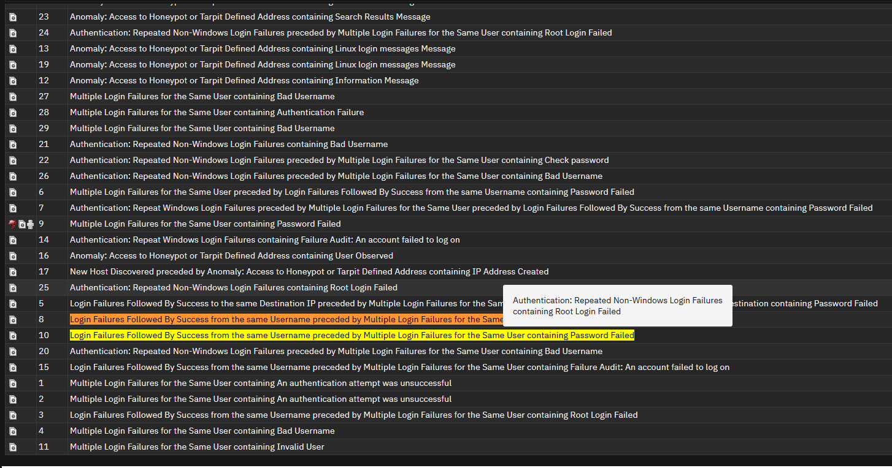

# Offense 006 — Repeated Windows Authentication Failures

## 1. Executive Summary
This offense focuses on repeated authentication failures observed in a **Windows-related authentication context**.

On its own, repeated Windows login failure activity can be noisy and is not always malicious. However, it becomes meaningful when the pattern suggests:

- repeated account pressure,
- broad user targeting,
- concentrated source behavior,
- or overlap with other suspicious authentication events.

This case is important because Windows authentication logs often contain some of the most useful evidence for identifying:

- brute-force attempts,
- password spraying,
- account misuse,
- or early credential-access activity.

From a SOC perspective, this offense should be treated as a **pattern analysis problem**, not just an event-count problem.

---

## 2. Detection Trigger
- **Observed Theme:** Repeated Windows authentication failures
- **Likely QRadar Logic:** Grouped failed Windows authentication events associated with one or more users or sources
- **Primary Risk:** Credential abuse / password guessing / account targeting
- **Suggested Severity:** Medium to High
- **Analyst Confidence:** Medium to High

---

## 3. Why This Offense Matters
Windows authentication failures are common in enterprise environments.

They can be caused by:

- normal user mistakes,
- expired credentials,
- stale sessions,
- service account problems,
- or legitimate but noisy admin activity.

However, they become more concerning when they show:

- repeated failure bursts,
- one source targeting multiple users,
- many attempts against one account,
- or overlap with success-after-failure patterns.

### Why this matters operationally
This means the analyst’s job is not simply to see the failures — it is to determine whether the pattern is:

- benign noise,
- operational misconfiguration,
- or suspicious credential abuse.

That distinction is the entire point of this case.

---

## 4. Initial Analyst Hypothesis
The initial working hypothesis is:

> A source, host, or actor is generating repeated Windows authentication failures in a way that may reflect password guessing or unauthorized login attempts.

The investigation should determine whether the pattern is more consistent with:

- user error,
- broken authentication processes,
- or attacker-driven account targeting.

The offense becomes more important if it overlaps with:

- valid account use,
- privileged account targeting,
- or later successful Windows logins.

---

## 5. Evidence Reviewed

### Screenshot 1 — Windows Authentication Failure Pattern

**What this screenshot helps show:**  
This screenshot helps visualize repeated authentication failure behavior in a way that supports offense-level analysis.

**Why it matters:**  
Repeated authentication failures are only useful if they can be interpreted as a meaningful pattern rather than isolated login noise.

---

### Screenshot 2 — Offense List / Supporting Context

**What this screenshot helps show:**  
This screenshot provides supporting context by showing how this offense fits within the larger QRadar investigation set.

**Why it matters:**  
It reinforces that this is part of a broader authentication-focused review and not just a one-off event.

---

## 6. Key Evidence Points
The most important indicators in this offense are:

- repeated Windows authentication failures,
- a visible pattern rather than isolated failed logins,
- and enough repetition to justify offense grouping and analyst review.

### Why that matters
Repeated Windows authentication failures often represent one of three things:

1. **normal user / operational noise**
2. **service or credential misconfiguration**
3. **credential abuse behavior**

The purpose of the investigation is to determine which explanation fits best.

---

## 7. Investigation Steps
A proper analyst review for this offense should include:

1. Review the offense summary and grouped Windows authentication events.
2. Identify the most repeated usernames involved.
3. Determine whether the failures are tied to:
   - one source,
   - one host,
   - many users,
   - or many systems.
4. Check whether the same source or account appears in:
   - brute-force cases,
   - privilege-focused offenses,
   - or later successful login sequences.
5. Determine whether the source is expected or unusual.
6. Review whether the affected usernames are:
   - human users,
   - service accounts,
   - or privileged identities.
7. Assess whether the pattern reflects noise or meaningful access pressure.

---

## 8. Analyst Interpretation
This offense is suspicious because it reflects repeated authentication pressure in a Windows context, but it should not automatically be assumed malicious without context.

### Why
Windows authentication is noisy by nature.

That means the analyst must evaluate not just the failures themselves, but the **shape of the behavior**:

- Is one source targeting many users?
- Is one user being hit repeatedly?
- Is the activity clustered in time?
- Does it overlap with other suspicious offenses?

### Security meaning
If the pattern is broad, repeated, and source-concentrated, it may indicate:

- brute-force attempts,
- password spraying,
- or account validation behavior.

If the pattern is narrow and operationally explainable, it may instead reflect normal environmental noise.

---

## 9. False Positive Considerations
This offense has several realistic benign explanations.

### Possible false positives
- Users entering the wrong password repeatedly
- Locked or expired Windows credentials
- Stale saved credentials
- Scheduled tasks or services using invalid passwords
- Administrative tooling causing repeated auth failures

### Why those explanations are not always enough
Those explanations become less convincing when:

- multiple users are targeted,
- the source is unusual or external,
- the same source appears across many systems,
- or the pattern overlaps with success-after-failure behavior.

That is why source, user, and timeline context are critical in this case.

---

## 10. MITRE ATT&CK Mapping
- **Primary Tactic:** Credential Access
- **Primary Technique:** **T1110 — Brute Force**
- **Secondary Technique Consideration:** **T1078 — Valid Accounts** (if later success is observed)

### Why this fits
This offense aligns with brute-force-style credential abuse because it reflects repeated authentication attempts intended to test or obtain access.

If successful login activity later follows, the risk interpretation increases significantly.

---

## 11. Recommended Validation / Next Steps
The SOC should validate this offense by:

- identifying the top source generating the failures,
- reviewing whether the same source targeted multiple Windows users,
- checking whether any targeted users later logged in successfully,
- confirming whether the affected accounts are user, service, or privileged accounts,
- and determining whether the pattern is expected in the environment.

### Escalate faster if:
- the source is external,
- the pattern targets many users,
- a privileged account is involved,
- or the failures later transition into successful access.

---

## 12. Final Analyst Verdict
**Assessment:** Suspicious repeated Windows authentication activity that may represent credential abuse depending on source, user, and progression context.

**SOC Action:**  
Investigate the source and affected identities, correlate with other authentication offenses, and escalate if the activity overlaps with broader credential abuse or successful access.
