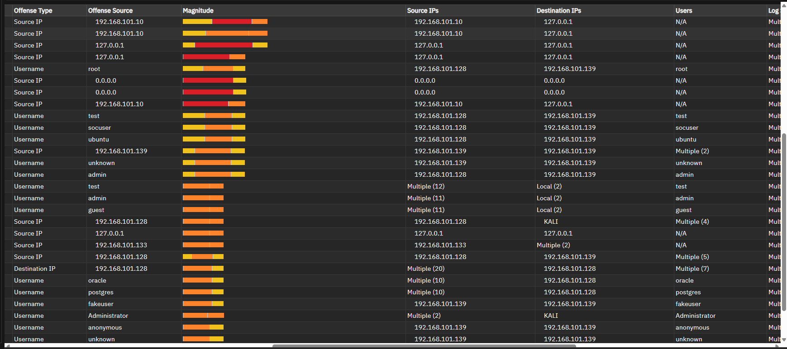
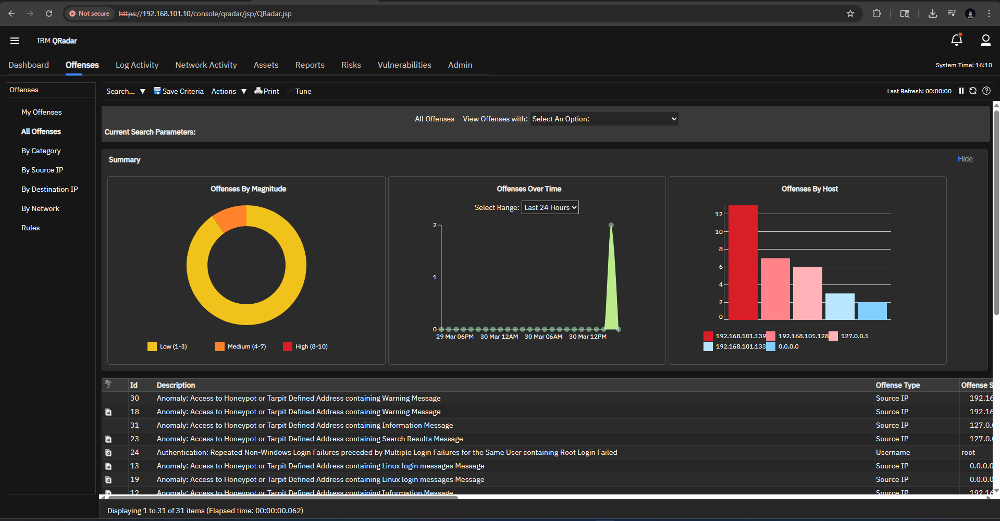

# Offense 008 — New Host Discovery and Reconnaissance

## 1. Executive Summary
This offense focuses on behavior consistent with **host discovery**, **network reconnaissance**, or **early-stage environment exploration**.

Unlike direct authentication abuse, this case is less about trying to log in and more about trying to **learn the environment**.

That makes it important because attackers often perform discovery before they attempt:

- credential abuse,
- lateral movement,
- privilege escalation,
- or targeted access against high-value systems.

This offense may indicate that a source or actor is attempting to identify:

- reachable systems,
- interesting hosts,
- exposed services,
- or potential next-step targets.

In a real SOC environment, this kind of activity is often easy to overlook because it may not immediately show “compromise.” But in practice, it is often one of the earliest visible indicators of malicious intent.

---

## 2. Detection Trigger
- **Observed Theme:** New host discovery / reconnaissance behavior
- **Likely QRadar Logic:** Correlated events suggesting system enumeration, broad host visibility, or exploratory access attempts
- **Primary Risk:** Reconnaissance / attack preparation / environment mapping
- **Suggested Severity:** Medium to High
- **Analyst Confidence:** Medium to High

---

## 3. Why This Offense Matters
Attackers rarely move directly to their final objective.

Before attempting privileged access or persistence, they often need to answer basic questions such as:

- What systems exist here?
- Which hosts are active?
- Which services respond?
- Which systems look valuable?

### Why this matters operationally
That means reconnaissance events are important not because they prove compromise, but because they may show **preparation for compromise**.

### Analyst mindset
A good analyst should ask:

> “Is this normal network behavior, or is someone trying to map the environment?”

That is the core question in this case.

---

## 4. Initial Analyst Hypothesis
The initial working hypothesis is:

> A source or actor is performing discovery behavior intended to identify hosts, services, or worthwhile targets within the environment.

The investigation goal is to determine whether the pattern is:

- expected administrative or scanning behavior,
- lab or tooling activity,
- or suspicious reconnaissance that should be escalated.

This offense becomes more important if the same source later appears in:

- authentication abuse,
- honeypot access,
- or privileged account targeting.

That kind of progression is exactly what analysts should look for.

---

## 5. Evidence Reviewed

### Screenshot 1 — Offense List / QRadar Context

**What this screenshot helps show:**  
This screenshot provides offense-level QRadar context and helps establish where this discovery-oriented offense fits within the broader investigation set.

**Why it matters:**  
It shows that the reconnaissance behavior should not be reviewed in isolation — it may be part of a larger suspicious storyline.

---

### Screenshot 2 — Offense Entities / Related Visibility

**What this screenshot helps show:**  
This screenshot is useful for understanding the systems, entities, or relationships associated with the offense.

**Why it matters:**  
Discovery and reconnaissance are often best understood through **scope and spread**, not just single events.

---

### Optional Supporting Screenshot

**What this screenshot helps show:**  
This supporting screenshot can help reinforce the broader QRadar context and provide additional evidence for how this offense was surfaced and grouped.

**Why it matters:**  
Reconnaissance often becomes more meaningful when reviewed alongside other suspicious activity in the same dataset.

---

## 6. Key Evidence Points
The strongest indicators in this offense are:

- host or entity discovery behavior,
- signs of environment exploration,
- and offense grouping that suggests broad or unusual system visibility activity.

### Why that matters
This type of activity is often associated with:

- scanning,
- host discovery,
- attack path preparation,
- or early-stage reconnaissance.

It may not be “loud” in the same way as brute force, but it can be strategically important because it often happens **before more direct attack behavior**.

---

## 7. Investigation Steps
A proper analyst review for this offense should include:

1. Review the offense summary and grouped discovery-related events.
2. Identify the source responsible for the host discovery behavior.
3. Determine how many hosts or systems were touched.
4. Assess whether the behavior appears:
   - broad,
   - targeted,
   - internal,
   - or external.
5. Check whether the source is a known scanner, admin system, or expected tool.
6. Determine whether the same source also appears in:
   - honeypot access,
   - authentication failures,
   - or username enumeration offenses.
7. Assess whether the behavior reflects expected operations or suspicious reconnaissance.

---

## 8. Analyst Interpretation
This offense is meaningful because it reflects **attacker learning behavior**, not just direct attack execution.

### Why
An actor performing discovery is often trying to answer:

- what is reachable,
- what is valuable,
- and where to go next.

That makes this offense important as an **early warning signal**, especially if it overlaps with later credential abuse or access attempts.

### Security meaning
The activity is consistent with:

- host discovery,
- environment mapping,
- exploratory scanning,
- or early-stage attack preparation.

This does not automatically prove compromise, but it does justify defensive attention because it may represent the **setup phase of a larger attack**.

---

## 9. False Positive Considerations
There are several legitimate explanations that should be reviewed before escalating.

### Possible false positives
- Internal vulnerability scanners
- Asset inventory tools
- Network management or monitoring systems
- Administrative discovery activity
- Lab or training environment scanning

### Why those explanations are not always enough
Those explanations become less convincing when:

- the source is unusual or external,
- the behavior is broad but not associated with known tools,
- the same source appears in credential-related offenses,
- or the activity overlaps with honeypot interaction or privileged targeting.

That is why source validation is especially important in reconnaissance cases.

---

## 10. MITRE ATT&CK Mapping
- **Primary Tactic:** Reconnaissance
- **Primary Technique:** **T1018 — Remote System Discovery**
- **Secondary Technique Consideration:** **T1046 — Network Service Scanning**

### Why this fits
This offense aligns well with ATT&CK discovery techniques because it reflects attempts to identify systems, relationships, or accessible services within the environment.

If the same actor later transitions into authentication or privilege-related activity, this case becomes even more meaningful as the **early recon phase** of a larger intrusion chain.

---

## 11. Recommended Validation / Next Steps
The SOC should validate this offense by:

- identifying the top source responsible for the discovery behavior,
- confirming whether the source is known, expected, or suspicious,
- determining whether the touched hosts are random or strategically interesting,
- checking whether the same source overlaps with other suspicious offenses,
- and validating whether the activity resembles legitimate scanning or hostile reconnaissance.

### Escalate faster if:
- the source is external,
- the source also appears in auth-related offenses,
- honeypot or privileged systems were touched,
- or the behavior spreads across many systems unexpectedly.

---

## 12. Final Analyst Verdict
**Assessment:** Suspicious host discovery / reconnaissance activity that may represent early-stage attacker environment mapping.

**SOC Action:**  
Validate the source, correlate with related suspicious offenses, and escalate if the reconnaissance overlaps with credential abuse, honeypot interaction, or privilege-focused activity.
